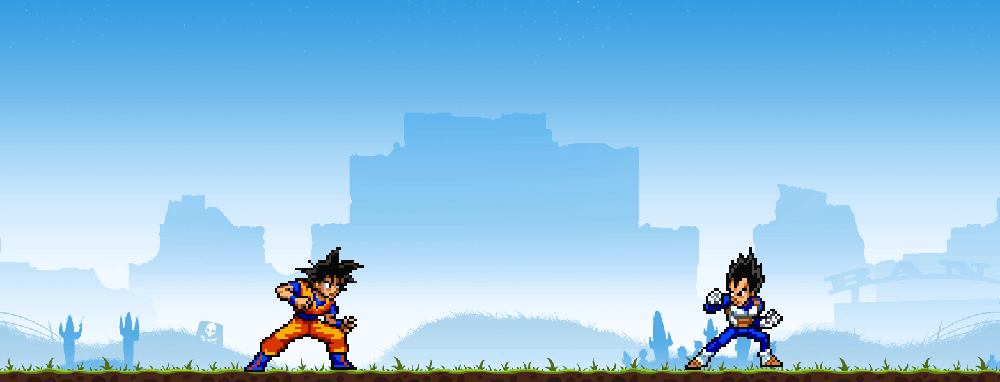

# DragonBall Arena

DBA is a multiplayer fighting game on the universe of DragonBallZ.

I have created it entierly myself mostly from scratch.
I have used external sources for :
- Slick2D : basic java 2D rendering library
- Kryonet : java server library
- sprite sheets from internet
- musics from internet

-------------------------------------------------------------------------------------------  
## Component:  

- Loading Screen

- Menu

- Character selection

- Multiplayer 1vs1 / 2vs2 fight is available. Actually no permanent online servers are available, so you will need to launch your own DBA server. You can download the server on my github: [DBAServer](https://github.com/Draym/DBAServer/releases/tag/V1.0.0). You can contact kevin.andres@epitech.eu for help.

Then it is needed to enter the serverIP in the 'BATTLE' screen.

- Possibility to modify controls and sound setings in the menu by pressing **esc**

 

-------------------------------------------------------------------------------------------  
## Gameplay:  

- Actually Goku and Vegeta are fully playable. Super saiyan form are also implemented for both.
- Every character have different attacks, absolutly no move are identical

Goku and Vegata got (it may changes for others) :
- 4 basics attack: punch, kick, ki, defense
- 1 special : if pressed only it gives energy, it can be used with another attack to do combo
- more than 10 combo attack
- 1 powerfull KI attack : special + KI
- 1 ultimate KI attack : 2 special + combo of 4 keys in a row
- super saiyan form (boost stat, offer new KI attacks)
 
 

- Classic attack + dodge

- Super Saiyans

- Kamehameha

- Gengidama

